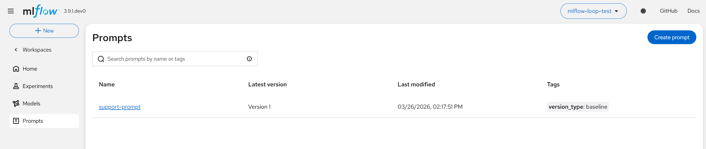
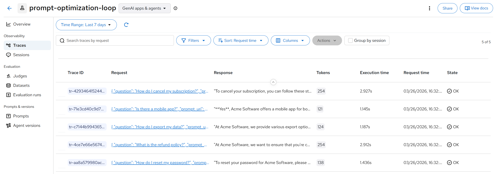
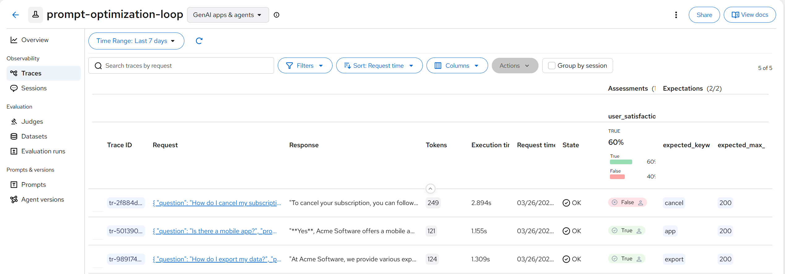
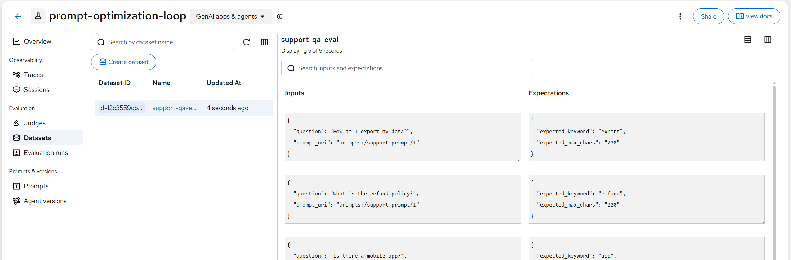
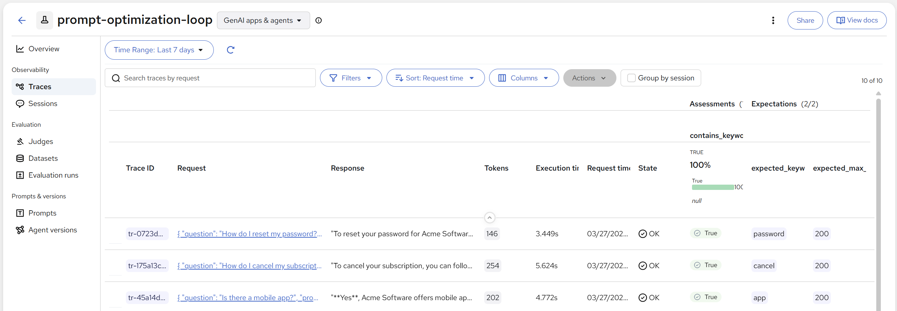
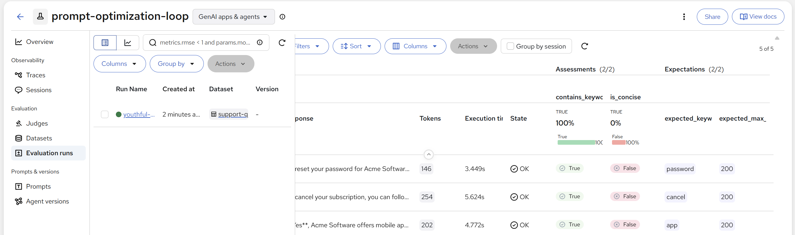
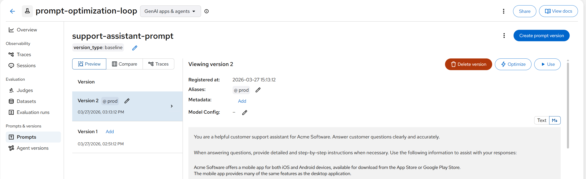
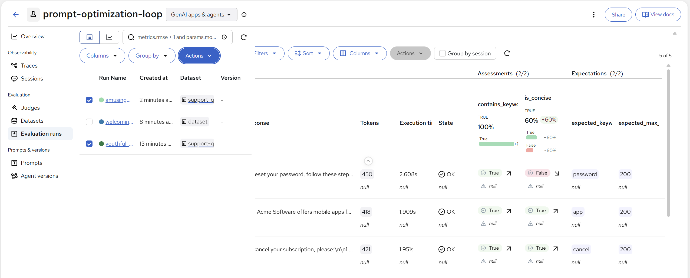

# MLflow on Red Hat OpenShift AI

This repository contains examples and documentation for using **MLflow on Red Hat OpenShift AI (RHOAI)**.

## Overview

MLflow is an open-source platform for managing the end-to-end machine learning lifecycle. This repo demonstrates:

1. **Prompt Optimization Loop** - Iteratively improve LLM prompts using MLflow's Prompt Registry, tracing, and evaluation
2. **Experiment Tracking** - Log parameters, metrics, and artifacts from ML training

---

## MLflow on RHOAI Setup

### Enable the MLflow Operator

Enable the MLflow operator through the RHOAI 3.2+ Platform operator:

```bash
kubectl patch datasciencecluster default-dsc \
  --type=merge \
  -p '{"spec":{"components":{"mlflowoperator":{"managementState":"Managed"}}}}'
```

### Deploy MLflow

For a simple quickstart, deploy MLflow using SQLite and artifact storage on a PersistentVolumeClaim (PVC):

```bash
cat <<'EOF' | kubectl apply -f -
apiVersion: mlflow.opendatahub.io/v1
kind: MLflow
metadata:
  name: mlflow
spec:
  storage:
    accessModes:
      - ReadWriteOnce
    resources:
      requests:
        storage: 100Gi
  backendStoreUri: "sqlite:////mlflow/mlflow.db"
  artifactsDestination: "file:///mlflow/artifacts"
  serveArtifacts: true
  image:
    imagePullPolicy: Always
EOF
```

> **Note:** This works from RHOAI 3.2 onwards.

### Access MLflow UI

Get the MLflow UI URL from the OpenShift route:

```bash
DS_GW=$(oc get route data-science-gateway -n openshift-ingress -o template --template='{{.spec.host}}')
echo "MLflow UI: https://$DS_GW/mlflow"
```

The MLflow UI is also accessible from the Applications drop-down in the OpenShift console or RHOAI/ODH dashboard navigation bar.

---

## Prompt Optimization Loop

The `mlflow_prompt_loop.ipynb` notebook walks through an end-to-end workflow for iteratively improving LLM prompts using MLflow as your observability and evaluation platform.

```
Create Prompt  →  Run Queries  →  Add User Feedback
      ↑                                   ↓
 Optimized Prompt  ←  Evaluate  ←  Upload Eval Dataset
```

### Quick Start

Open `mlflow_prompt_loop.ipynb` in your RHOAI workbench and fill in the configuration block at the top:

```python
MLFLOW_TRACKING_URI = "https://rh-ai.<CLUSTER-DOMAIN>/mlflow"
MLFLOW_TRACKING_TOKEN = "<OPENSHIFT-API-TOKEN>"
LLM_API_KEY    = "<MODEL-API-KEY>"
LLM_BASE_URL   = "<MODEL-ENDPOINT>"
LLM_MODEL      = "<MODEL-NAME>"
```

Then run the cells top to bottom — each step builds on the previous one.

### What the notebook covers

**Step 1 — Create your prompt**
Register a system prompt in MLflow's Prompt Registry. Every `register_prompt` call creates an immutable versioned snapshot. A `prod` alias is set immediately so external code can always load the current best prompt via `prompts:/support-assistant-prompt@prod` without knowing the version number.



**Step 2 — Run queries**
Send sample questions through the LLM with `mlflow.openai.autolog()` enabled. Each call to `load_prompt()` inside a traced function links the trace to the exact prompt version.



**Step 3 — Add feedback and expectations**
Attach simulated user feedback (`mlflow.log_feedback`) and ground-truth expectations (`mlflow.log_expectation`) directly to each trace — visible in the MLflow UI alongside the trace details.



**Step 4 — Build an evaluation dataset from traces**
Create a dataset by passing the annotated trace objects directly to `merge_records()`, mirroring what the MLflow UI does when you select traces to add to a dataset. Inputs, outputs, expectations, and prompt linkage are extracted automatically.



**Step 5 — Evaluate prompt v1**
Run `mlflow.genai.evaluate()` against the hosted dataset with two custom scorers:
- **contains_keyword** — does the response mention the required term?
- **is_concise** — is the response under the character limit?




**Step 6 — Optimize the prompt**
Use `mlflow.genai.optimize_prompts()` with the GEPA optimizer (Generate, Evaluate, Predict, Adapt). It analyses which examples failed, rewrites the prompt to address the weaknesses, and registers the result as a new version. The `prod` alias is then moved to point at the improved version.



**Step 7 — Compare results**
Re-evaluate using the optimized prompt against the same dataset and scorers, then print a side-by-side comparison table. Any score difference is purely attributable to the prompt change.

